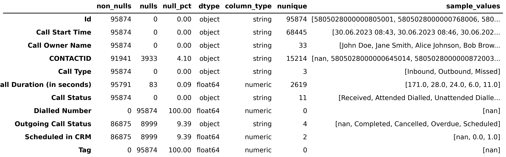
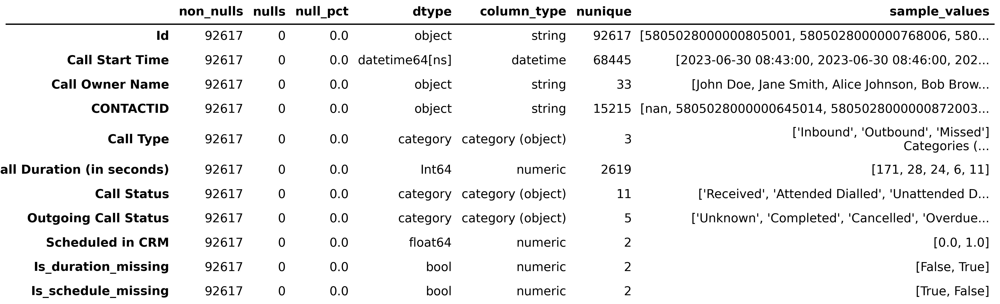

# Calls Dataset Cleaning (`01_data_cleaning.py`)

This document describes the full data-cleaning workflow for the **Calls** dataset in the *IT School Analytics* project.  
It includes data preparation, anomaly detection, and export of clean results.

---

## 1️⃣ Initial Overview

The raw dataset **`calls.xlsx`** was loaded and summarized using the `DataSummary` class.  
This initial report provided insights into:
- data types,  
- missing values,  
- unique counts,  
- and sample values.

---

## 2️⃣ Removing Irrelevant Columns

Two columns were dropped as they contained entirely empty values and provided no analytical value.
- `Dialled Number`
- `Tag`

After removal, the dataset became more compact and focused on relevant business metrics.

---

## 3️⃣ Duplicate Detection and Removal

Duplicates were identified using `find_duplicates()` and removed with `clean_duplicates()`.  
All duplicate counts were logged.  
The cleaned version of the dataset was stored as **`clean_calls`**.

---

## 4️⃣ Date Conversion

The column **`Call Start Time`** was converted to `datetime` format to enable time-series analysis and visualization.  

---

## 5️⃣ Missing Value Analysis and Handling

### 5.1 CONTACTID

Rows with missing **`CONTACTID`** values were analyzed separately to assess potential data loss.  
The inspection showed that most of these rows represented incomplete call records with no associated contact information.

Rows meeting both conditions were removed:
- `CONTACTID` is missing (`NaN`, `'nan'`, `'None'`, or empty string`)  
- `Call Duration (in seconds)` equals **0**

This ensured that non-informative call entries (zero duration and no contact reference) were excluded from the dataset.

> *Removed all rows with missing `CONTACTID` and zero call duration.*

### 5.2 Call Duration

The column **`Call Duration (in seconds)`** contained several missing values.  
To preserve analytical consistency:
- Missing durations were filled with **0**,  
- A binary flag **`Is_duration_missing`** was added to mark originally missing records.  

This approach retained all call entries while making missing data explicitly traceable.

> *Filled missing durations with 0 and added the indicator `Is_duration_missing`.*

### 5.3 Outgoing Call Status

Some records lacked an **`Outgoing Call Status`** value.  
To prevent categorical gaps and maintain consistency, all missing values were replaced with **`'Unknown'`**.

> *Filled missing Outgoing Call Status values with `'Unknown'`.*

### 5.4 Scheduled in CRM

The column **`Scheduled in CRM`** occasionally contained null values.  
To ensure numerical consistency:
- Missing values were replaced with **0.0**,  
- A flag **`Is_schedule_missing`** was added to track originally empty records.  

> *Filled missing `Scheduled in CRM` values with 0.0 and added the indicator `Is_schedule_missing`.*

---

## 6️⃣ Type Conversion

To optimize performance and ensure proper categorical encoding:
| Column | Converted Type |
|---------|----------------|
| `Call Type` | category |
| `Call Status` | category |
| `Outgoing Call Status` | category |

---

## 7️⃣ Final Summary After Cleaning

A final statistical overview was generated for the cleaned dataset.

The difference between the raw and cleaned summaries clearly demonstrates:
- reduced missing data,  
- corrected data types,  
- and removal of irrelevant columns.

---

## Final Results Overview

| Step | Action Performed |
|------|------------------|
| Column pruning | Removed empty or non-informative fields to reduce noise |
| Duplicate removal | Identified and eliminated duplicate entries |
| Missing data | Applied logical imputation and added missing-value indicators |
| Type conversion | Standardized column types (datetime, category) for analytical consistency |
| Exports | Prepared cleaned dataset and generated summary visualizations |

---

## Next Step

With the Calls dataset cleaned and verified, the next stage continues with **Contacts** data preparation and validation.
**Continue to:** [01_3_contacts_cleaning.md](01_3_contacts_cleaning.md)
