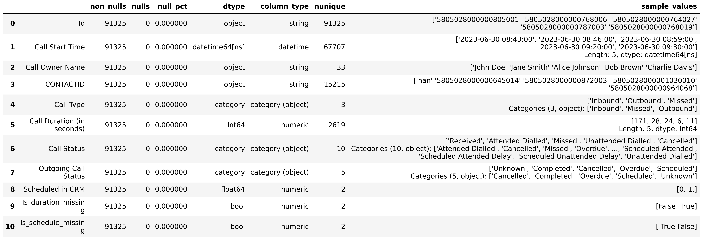

# Calls Dataset Cleaning (`data_cleaning.py`)

This document describes the full data-cleaning workflow for the **Calls** dataset in the *IT School Analytics* project.  
It includes data preparation, anomaly detection, and export of clean results.

---

## 1️⃣ Initial Overview

The raw dataset **`calls.xlsx`** was loaded and summarized using the `DataSummary` class.  
This initial report provided insights into:
- data types,  
- missing values,  
- unique counts,  
- and sample values.

---

## 2️⃣ Removing Irrelevant Columns

Two columns were dropped as they contained non-analytical or redundant information:
- `Dialled Number`
- `Tag`

After removal, the dataset became more compact and focused on relevant business metrics.

---

## 3️⃣ Duplicate Detection and Removal

Duplicates were identified using `find_duplicates()` and removed with `clean_duplicates()`.  
All duplicate counts were logged.  
The cleaned version of the dataset was stored as **`clean_calls`**, containing only unique call records.

---

## 4️⃣ Date Conversion

The column **`Call Start Time`** was converted to `datetime` format to enable time-series analysis and visualization.  
Any invalid or inconsistent formats were automatically coerced to `NaT`.

---

## 5️⃣ Missing Value Analysis and Handling

### 5.1 CONTACTID
Some calls lacked a contact identifier.  
Such rows mostly corresponded to **Inbound** or **Missed** calls, where linking to a contact was not possible.  
They were **kept intentionally**, preserving logical integrity.

### 5.2 Call Duration
- Missing durations were replaced with **0 seconds**.  
- A binary flag **`Is_duration_missing`** was added to mark originally missing values.

### 5.3 Outgoing Call Status
- Missing values were replaced with `'Unknown'`.  
- This prevented categorical inconsistencies and maintained uniform grouping.

### 5.4 Scheduled in CRM
- Missing values were filled with `0.0`.  
- A boolean flag **`Is_schedule_missing`** was added to indicate originally missing schedule info.

---

## 6️⃣ Outlier Detection — Duration Analysis

Outlier detection was performed using:
- **Interquartile Range (IQR)**  
- **Three Sigma Rule (3σ)**  

Outliers were highlighted both in histograms and scatter plots.

### Outlier Detection Visualization

Two views were generated:
- **Left:** Histogram showing IQR-based outliers  
- **Right:** Scatter plot of call duration over time with 3σ threshold  

From these visualizations, it is clear that the **distribution of call durations is not normal** —  
it is heavily right-skewed, with a long tail of extended calls.

These visualizations are therefore **not intended for detailed statistical analysis**,  
but rather for **an initial diagnostic check** — to determine whether long-duration outliers should be excluded or retained.

For future analytical steps, **logarithmic transformation** and other **robust statistical techniques** will be applied to correctly handle the non-normal distribution of call durations.

---

## 7️⃣ Type Conversion

To optimize performance and ensure proper categorical encoding:
| Column | Converted Type |
|---------|----------------|
| `Call Type` | category |
| `Call Status` | category |
| `Outgoing Call Status` | category |

---

## 8️⃣ Final Summary After Cleaning

A final statistical overview was generated for the cleaned dataset.

The difference between the raw and cleaned summaries clearly demonstrates:
- reduced missing data,  
- corrected data types,  
- and removal of irrelevant columns.

---

## Final Results Overview

| Step | Action Performed |
|------|------------------|
| Column pruning | Removed non-informative fields to reduce noise |
| Duplicate removal | Identified and eliminated duplicate entries |
| Missing data | Applied logical imputation and added missing-value indicators |
| Outlier detection | Detected long-call anomalies for later statistical review |
| Type conversion | Standardized data types for analytical consistency |
| Exports | Saved cleaned dataset and visual summaries (PNG format) |

---

## Next Step

The next stage continues with **Contacts** dataset cleaning
