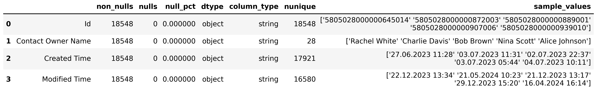
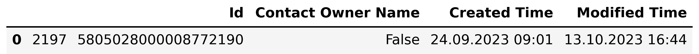
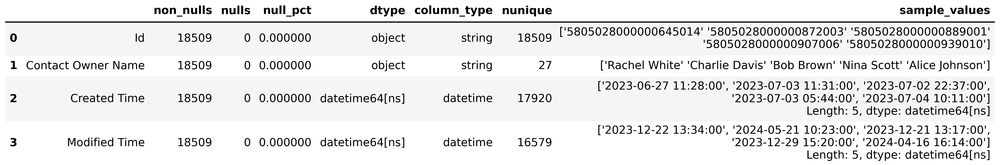

# Contacts Dataset Cleaning (`01_data_cleaning.py`)

This document describes the **data cleaning process** for the `Contacts` dataset.

## Table of Contents

1. [Initial Data Overview](#1️⃣-initial-data-overview)
2. [Duplicate Detection and Removal](#2️⃣-duplicate-detection-and-removal)
3. [Detection of Invalid Boolean Entries](#3️⃣-detection-of-invalid-boolean-entries)
4. [Datetime Conversion](#4️⃣-datetime-conversion)
5. [Logical Consistency Check](#5️⃣-logical-consistency-check)
6. [Final Data Summary](#6️⃣-final-data-summary-after-cleaning)
7. [Results and Exports](#7️⃣-results-and-exports)
8. [Next step](#8️⃣-next-step)

---

## 1️⃣ Initial Data Overview

The raw dataset was explored using the `DataSummary` class, which generated a detailed overview of column types, missing values, unique counts, and example entries.

---

## 2️⃣ Duplicate Detection and Removal

Duplicate rows were identified across all columns using the `find_duplicates()` function.  
They were removed via `clean_duplicates()`, resulting in a unique and consistent dataset.

The cleaned dataset was saved as **`clean_contacts`**.

---

## 3️⃣ Detection of Invalid Boolean Entries

Some invalid Boolean values (`True` / `False`) were found in the field **`Contact Owner Name`**.  
Such rows were inspected and removed.
 

After cleaning, all entries in `Contact Owner Name` contained valid string values corresponding to actual users.

---

## 4️⃣ Datetime Conversion

The following columns were converted to **datetime** type to ensure accurate time analysis and filtering:
- `Created Time`
- `Modified Time`

This step guarantees consistent time-based comparisons and sorting.

---

## 5️⃣ Logical Consistency Check

A verification was performed to ensure that `Created Time` was **not later than** `Modified Time`.  
**Result:** No inconsistent timestamp records were found.

This confirms that the dataset respects the logical order of record creation and updates.

---

## 6️⃣ Final Data Summary (After Cleaning)

A new summary table was generated for the cleaned dataset to confirm successful transformation.

### Summary Table — Cleaned Contacts Data  

---

## 7️⃣ Results and Exports

| Step | Description |
|------|--------------|
| Duplicate removal | Removed duplicate rows |
| Invalid entries | Excluded Boolean (`True`/`False`) values from `Contact Owner Name` |
| Datetime conversion | Converted `Created Time` and `Modified Time` |
| Consistency check | Verified no `Created Time` > `Modified Time` |
| Exports | Saved cleaned dataset and PNG summaries |

## 8️⃣ Next step
With the Contacts dataset cleaned and validated, the next stage proceeds with **Spend** dataset preparation and cleaning.  
**Continue to:** [01_4_spend_cleaning.md](01_4_spend_cleaning.md)
