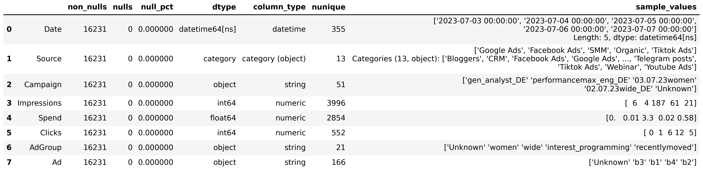

# Spend Dataset Cleaning (`01_data_cleaning.py`)

This document provides a detailed explanation of the **data cleaning process** for the `Spend` dataset.  

## Table of Contents

1. [Initial Data Overview](#1️⃣-initial-data-overview)
2. [Duplicate Detection and Removal](#2️⃣-duplicate-detection-and-removal)
3. [Removal of Test Records](#3️⃣-removal-of-test-records)
4. [Removal of Zero-Value Rows](#4️⃣-removal-of-zero-value-rows)
5. [Handling Missing Fields](#5️⃣-handling-missing-fields)
6. [Cleaning and Correcting Spend Values](#6️⃣-cleaning-and-correcting-spend-values)
7. [Type Conversion](#7️⃣-type-conversion)
8. [Final Data Summary](#8️⃣-final-data-summary-after-cleaning)
9. [Results and Exports](#9️⃣-results-and-exports)
10. [Next Step](#1️⃣0️⃣-next-step)

---

## 1️⃣ Initial Data Overview

The raw dataset was analyzed using the `DataSummary` utility,  
which profiled each field for completeness, data type, and distinct values.  
This helped identify issues such as duplicate records, missing fields, and test data that needed to be removed.
 

---

## 2️⃣ Duplicate Detection and Removal

Full-row duplicates were identified using the `find_duplicates()` function  
and then removed with the `clean_duplicates()` routine.

**Result:** All duplicate entries were successfully removed.  
**Output DataFrame:** `clean_spend`

This ensured that every advertising record (by date, source, campaign, and ad) is unique and consistent.

---

## 3️⃣ Removal of Test Records

A separate check was performed for rows where the **`Source`** field was labeled as `Test`.  
These represented experimental or placeholder entries not relevant for production analytics.

All such records were removed to maintain dataset purity.

> *Removed all rows where `Source = 'Test'`.*

---

## 4️⃣ Removal of Zero-Value Rows

Rows where **`Impressions`**, **`Spend`**, and **`Clicks`** were all equal to `0`  
were identified as non-informative and removed.

**Rationale:** These entries represent campaigns or ad groups with no activity and therefore do not contribute to analytical insights.

> *Removed all rows with zero values across key performance metrics.*

---

## 5️⃣ Handling Missing Fields

To standardize incomplete campaign metadata, missing values in the following columns were filled with `'Unknown'`:

- `Campaign`  
- `AdGroup`  
- `Ad`

This approach preserves data structure while making missingness explicit for analysts.

**Result:** All missing text fields replaced with `"Unknown"`.  
**Rationale:** Prevents merge errors during joins with CRM and Ad tracking data.

---

## 6️⃣ Cleaning and Correcting Spend Values

The **`Spend`** column was normalized using the custom utility `clean_amount()`.  
This function cleans formatting inconsistencies such as:
- stray currency symbols,  
- comma vs. dot decimal separators,  
- and string-based numeric representations.

**Result:** All values in `Spend` were converted to clean numeric format suitable for financial analysis.

---

## 7️⃣ Type Conversion

The `Source` column was converted to a **categorical** data type to optimize memory usage and enable efficient grouping and filtering in further analysis.

**Converted columns:**  
| Column | Type |
|---------|------|
| `Source` | category |

---

## 8️⃣ Final Data Summary (After Cleaning)

A new data summary was generated using the `DataSummary` class to verify the cleaning results.

---

## 9️⃣ Results and Exports

| Step | Description |
|------|--------------|
| Data profiling | Created initial field summary via `DataSummary` |
| Duplicate removal | Removed fully identical records |
| Test data removal | Excluded rows where `Source = 'Test'` |
| Zero-value removal | Deleted records with 0 in all performance fields |
| Missing fields | Replaced with `"Unknown"` for key metadata columns |
| Spend normalization | Cleaned and converted `Spend` values using `clean_amount()` |
| Type conversion | Converted `Source` to categorical type |
| Exports | Saved clean dataset and PNG summaries |

---

## 1️⃣0️⃣ Next Step

With the Spend dataset cleaned and verified, the next stage continues with **Deals** dataset preparation and cleaning.

**Continue to:** [01_5_deals_cleaning.md](01_5_deals_cleaning.md)
