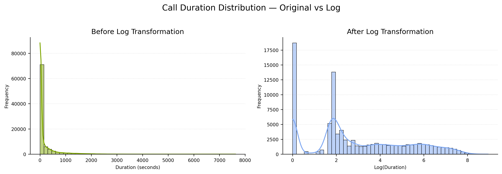
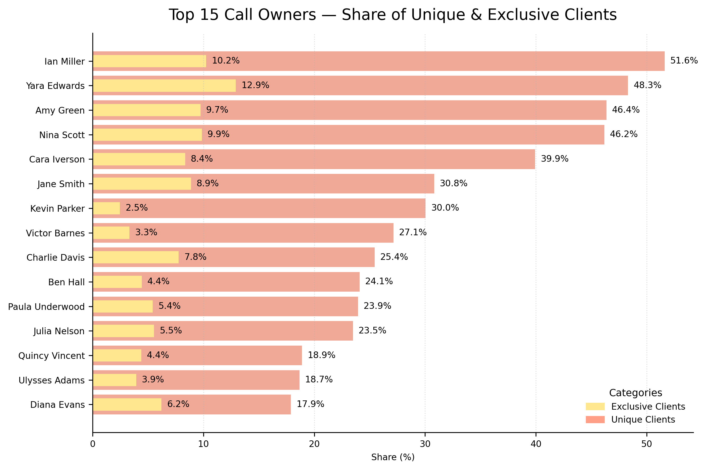

# Descriptive Statistics — Calls Data (`02_descriptive_statistics.py`)

This section explores the **descriptive statistics** of the cleaned `Calls` dataset, covering both **numeric** and **categorical** variables.  
The objective is to examine the structure of call durations, evaluate the effects of logarithmic transformation, and analyze agent performance patterns across different dimensions.

## Table of Contents

1. [Numeric Fields](#1️⃣-numeric-fields)
 - [1.1 Descriptive Overview](#descriptive-overview)
 - [1.2 Call Duration by Day of the Week](#call-duration-by-day-of-the-week)
 - [1.3 Call Duration Distribution — Before & After Log Transformation](#call-duration-distribution--before--after-log-transformation)
 - [1.4 Violin Plot — Distribution Comparison](#violin-plot--distribution-comparison)
 - [1.5 Statistical Comparison — Before vs After Log](#statistical-comparison--before-vs-after-log)
2. [Categorical Fields](#2️⃣-categorical-fields)
 - [2.1 Overview of Categorical Attributes](#overview-of-categorical-attributes)
 - [2.2 Top 15 Call Owners — Total, Unique & Exclusive Clients](#top-15-call-owners--total-unique--exclusive-clients)
 - [2.3 Unique & Exclusive Client Share (%)](#unique--exclusive-client-share-)
 - [2.4 Calls by Day of the Week](#calls-by-day-of-the-week)
3. [Key Insights](#3️⃣-key-insights)
4. [Next Step](#4️⃣-next-step)

---

## 1️⃣ Numeric Fields

### 1.1 Descriptive Overview

The `describe_num()` function generated a summary of numerical features — including central tendency, dispersion, and shape statistics.

> The dataset contains **≈92 000 call records**.  
> The average duration is **170 s**, but the **high standard deviation (≈ 407 s)** and **skewness (≈ 4.0)** indicate a **right-skewed distribution**, typical for communication data with many short calls and few extremely long ones.

---

### 1.2 Call Duration by Day of the Week

To analyze weekly activity, average call duration was aggregated by weekday.  

> **Wednesday and Thursday** show slightly longer average durations, possibly reflecting higher engagement mid-week.  
> Weekend calls remain significantly shorter and less frequent.

---

### 1.3 Call Duration Distribution — Before & After Log Transformation

The distribution of call durations before and after applying logarithmic transformation.

> The original histogram is sharply right-skewed with heavy tails.  
> After applying `log1p()`, the curve becomes **smooth and approximately normal**, improving suitability for correlation and regression analyses.

---

### 1.4 Violin Plot — Distribution Comparison

Violin plots visualize the spread and quartiles for the raw and log-transformed durations.  

> The **spread significantly decreases** after transformation, compressing extreme values while maintaining the overall structure of duration variability.

---

### 1.5 Statistical Comparison — Before vs. After Log

The `compare_distributions()` function quantifies how transformation affects numeric properties.

> The transformation reduces **mean, range, and variance** by more than 90%.  
> **Skewness** decreases from 4.00 → 0.41 and **kurtosis** from 21.95 → –0.90, confirming that log scaling effectively normalizes the distribution.

Visualized percentage change of key metrics:

> The drastic reduction in variability (SD ↓ 99%) and asymmetry (Skew ↓ 90%) clearly demonstrates the stabilizing effect of the logarithmic transformation.

---

## 2️⃣ Categorical Fields

### 2.1 Overview of Categorical Attributes

The `describe_cat()` function summarized unique counts, top categories, and their frequency share.

> There are **33 call owners** managing **≈15 000 unique contacts**.  
> Around **90% of calls are outbound**, and the top agent (**Yara Edwards**) handles about **9% of all calls**, indicating a high workload concentration.

---

### 2.2 Top 15 Call Owners — Total, Unique & Exclusive Clients

A bar chart compares each owner’s total calls, number of unique clients, and those served exclusively.

> **Yara Edwards** leads with 8 532 calls (≈ 9% of total).  
> The ratio of exclusive clients remains low, suggesting **shared ownership** of contacts and  **collaboration across sales and support teams**.

---

### 2.3 Unique & Exclusive Client Share (%)

Proportional comparison of unique vs. exclusive clients per owner.

> For most owners, **unique contacts** account for 60–80 % of their portfolio, while **exclusive ownership** rarely exceeds 30 %, reflecting significant overlap between agents’ contact lists.

---

### 2.4 Calls by Day of the Week

Frequency of total calls by weekday, using ordered weekday indexing.

> Activity peaks on **Tuesday – Thursday**, gradually dropping toward the weekend.  
> This pattern aligns with operational cycles and client availability in standard business hours.

---

## 3️⃣ Key Insights

- **Right-Skewed Distribution:** Raw call durations exhibit long-tail behavior typical of telecom datasets.  
- **Successful Normalization:** Log transformation improved normality and reduced variance by > 90%.  
- **Operational Imbalance:** A few agents handle the majority of calls.  
- **Client Overlap:** Many contacts are managed by multiple owners, reflecting team-based engagement.  
- **Consistent Patterns:** Weekday peaks suggest predictable workflow intensity and scheduling efficiency.

---

## 4️⃣ Next Step

With numerical and categorical profiles explored, the next stage proceeds to **Contacts Dataset Descriptive Statistics**, examining client-level activity, source distribution, and demographic segmentation.

**Continue to:** [02_2_contacts_descriptive_stats.md](02_2_contacts_descriptive_stats.md)
