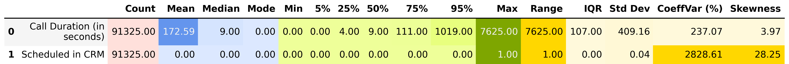
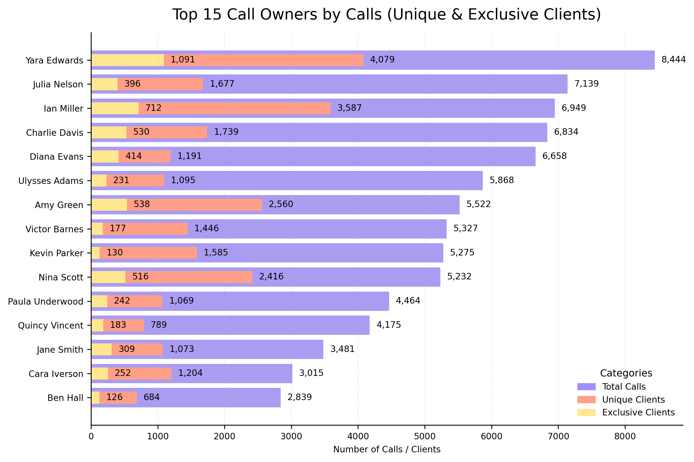

# Descriptive Statistics — Calls Data (`02_descriptive_statistics.py`)

This section explores the **descriptive statistics** of the cleaned `Calls` dataset, covering both **numeric** and **categorical** variables.  
The objective is to examine the structure of call durations, evaluate the effects of logarithmic transformation, and analyze agent performance patterns across different dimensions.

## Table of Contents

1. [Numeric Fields](#1️⃣-numeric-fields)
   - [1.1 Descriptive Overview](#11-descriptive-overview)
   - [1.2 Call Duration by Day of the Week](#12-call-duration-by-day-of-the-week)
   - [1.3 Call Duration Distribution — Before & After Log Transformation](#13-call-duration-distribution--before--after-log-transformation)
   - [1.4 Violin Plot — Distribution Comparison](#14-violin-plot--distribution-comparison)
   - [1.5 Statistical Comparison — Before vs After Log](#15-statistical-comparison--before-vs-after-log)
2. [Categorical Fields](#2️⃣-categorical-fields)
   - [2.1 Overview of Categorical Attributes](#21-overview-of-categorical-attributes)
   - [2.2 Top 15 Call Owners — Total, Unique & Exclusive Clients](#22-top-15-call-owners--total-unique--exclusive-clients)
   - [2.3 Unique & Exclusive Client Share (%)](#23-unique--exclusive-client-share-)
   - [2.4 Calls by Day of the Week](#24-calls-by-day-of-the-week)
3. [Key Insights](#3️⃣-key-insights)
4. [Next Step](#4️⃣-next-step)

---

## 1️⃣ Numeric Fields

### 1.1 Descriptive Overview

The `describe_num()` function generated a summary of numerical features — including central tendency, dispersion, and shape statistics.

> The dataset contains **91 325 call records**.  
> - The average call lasts **about 3 minutes (172 s)**, but the median is only **9 seconds**, indicating a **heavily right-skewed distribution** with many short calls and a few extremely long ones.
> - The **standard deviation (409 s)** and **range (0–7625 s)** confirm substantial variability.  
> - The CRM scheduling variable has almost all zero values — meaning **very few calls are scheduled directly through CRM**, and this field contributes minimal analytical value at this stage.

---

### 1.2 Call Duration by Day of the Week

To analyze weekly activity, average call duration was aggregated by weekday.  

> Observations
> - Average durations remain **remarkably consistent** from **Monday to Friday**, fluctuating between **170–176 seconds**.
> - **Wednesday and Thursday** show a slight uptick in duration, suggesting **higher engagement mid-week**.  
> - The **shortest average duration** occurs on **Sunday (≈161 s)**, which aligns with **reduced business activity** and possibly lower call complexity on weekends.  
> - Variability across days is minimal — the gap between the longest and shortest averages is only **about 15 seconds (≈9%)**.
> Interpretation
> - The stability of averages implies that **conversation quality and interaction depth are consistent**, regardless of the weekday.  
> - The mild mid-week increase may reflect **operational focus or client availability**, when most follow-ups and conversions take place.  
> - **Weekend calls** tend to be **shorter and less frequent**, typical for low-volume service periods.
> Analytical Insight
> This pattern suggests a **balanced workload distribution** and **steady agent performance** through the week.  
> However, monitoring weekday-specific call counts alongside durations could reveal **whether shorter weekend calls stem from fewer contacts or different interaction types**.

---

### 1.3 Call Duration Distribution — Before & After Log Transformation

The distribution of call durations before and after applying logarithmic transformation.

> *(Left panel of `call_duration_orig_vs_log.png`)*   
> - A **sharp peak near zero** dominates the histogram — most calls last under **10 seconds**, aligning with the median (9s) and 25th percentile (4 s). These represent **short attempts**, failed connections, or quick follow-ups.  
> - A **very long right tail** extends up to ~7,600 s (~2 hours 7 minutes), producing extreme **skewness (3.97)** and **kurtosis (21.6)**.  
> - **Interpretation:** The raw duration distribution is **highly right-skewed**, unsuitable for linear or parametric modeling due to instability and outlier sensitivity.  
> - **Practical implication:** Any correlation or regression analysis should first **normalize or transform** the variable.
> *(Right panel of `call_duration_orig_vs_log.png`)*  
> - After log transformation, the shape becomes **smoother and nearly symmetric**, compressing extreme values.  
> - The density curve shows **multi-modality**, revealing several operational regimes:  
>  - Around **0–1.6** → extremely short calls (1–5 s).  
>  - Around **2.3** → typical quick conversations (~9 s).  
>  - Around **4.5–6.0** → full-length discussions (2–7 min).  
> - **Interpretation:** The transformation preserves structure while stabilizing variance — ideal for **parametric or correlation analysis**.  
> - **Analytical note:** Multiple peaks suggest **heterogeneous call types**; further segmentation (by Call Type or Status) is recommended.

---

### 1.4 Violin Plot — Distribution Comparison

Violin plots visualize the spread and quartiles for the raw and log-transformed durations.  

> *(Left panel of `call_duration_distribution.png`)*  
> - The “violin” is **thin at the base with a long upper spike**, confirming a concentration of short calls and sparse long ones.  
> - Quartile lines align with descriptive stats:  
>  - Q1 = 4 s, Median = 9 s, Q3 = 111 s.  
> - **Interpretation:**  
>  - 75 % of all calls last under **two minutes**.  
>  - A small fraction of long conversations **inflate the mean (172 s)** and standard deviation (409 s).  
> - **Recommendation:** Use **median and IQR** for reporting instead of mean to avoid distortion by outliers.

> *(Right panel of `call_duration_distribution.png`)*  
> - The distribution becomes **balanced and bell-shaped**, clearly showing the central mass of calls.  
> - Quartile positions on the log scale correspond to:  
>  - Q1 ≈ 1.61 (log 4 s), Median ≈ 2.30 (log 9 s), Q3 ≈ 4.71 (log 111 s).  
> - **Interpretation:** The transformation improves visibility of patterns and equalizes spread.  
> - **Recommendation:** For comparative or modeling purposes, analyze durations in the **log-space** or apply **robust statistics**.

---

### 1.5 Statistical Comparison — Before vs. After Log

The `compare_distributions()` function quantifies how transformation affects numeric properties.

> - The **mean and standard deviation** drop by almost **99%**, demonstrating that extreme values no longer dominate the dataset.  
> - **Skewness** decreases from **3.97 → 0.39**, and **kurtosis** from **21.63 → –0.90**, which means the distribution changes from **highly right-skewed** to **approximately symmetric and flat**.  
> - The **median (9 s)** remains proportionally aligned with the log-scale central value (≈2.3), showing that transformation preserves ranking relationships and data integrity.  
> - **Overall effect:** The transformation eliminates the long tail while maintaining the relative structure of durations.

Visualized percentage change of key metrics:

> - **Variance-related metrics (Std Dev, Range)** decreased by **97–99%**, indicating far more stable dispersion.  
> - **Shape metrics (Skewness, Kurtosis)** dropped by **90–104%**, confirming that the distribution became **nearly normal**.  
> - The log transformation **compresses outliers** without distorting proportional differences among typical calls.  
> - The dataset is now **statistically well-conditioned** for regression, correlation, and trend modeling.

> **Conclusion:** Logarithmic transformation dramatically improved data normality and reduced heteroscedasticity, making call duration analysis more reliable for downstream statistical and predictive modeling.

---

## 2️⃣ Categorical Fields

### 2.1 Overview of Categorical Attributes

The `describe_cat()` function summarized unique counts, top categories, and their frequency share.

> Analytical Observations
> - **Outbound calls dominate (91%)**, confirming a **proactive customer engagement model** rather than reactive inbound handling.  
> - The **high completion rate (91%)** paired with **76% attended calls** indicates **operational efficiency and successful connection rates**.  
> - With **33 unique call owners**, the dataset reflects **a well-distributed but centralized structure**, where a few agents — notably **Yara Edwards (9.25%)** — handle a significant share of interactions.  
> - **Wednesday (18.5%)** stands out as the **busiest weekday**, consistent with midweek peaks observed in numeric analysis.

> Business Interpretation
> - The dominance of outbound and completed calls demonstrates a **strong sales or outreach-driven operation**, focused on active client contact rather than inbound support.  
> - The consistent performance across weekdays, with a midweek peak, may suggest **optimized scheduling** aligned with customer responsiveness.  
> - A small subset of high-performing agents contributes disproportionately, indicating potential for **knowledge sharing or workload balancing**.

---

### 2.2 Top 15 Call Owners — Total, Unique & Exclusive Clients

A bar chart compares each owner’s total calls, number of unique clients, and those served exclusively.

> - **Yara Edwards** dominates call volume with **8,444 calls**, almost **30% higher** than the second-ranked **Julia Nelson** and **Ian Miller**.  
> - The majority of agents manage **3K–6K calls**, indicating **a broad workload range** and potential specialization among teams.  
> - The overlay of **unique** and **exclusive** clients shows that while many contacts are handled by one owner, **true exclusivity is rare**, implying **collaboration and shared accounts**.

---

### 2.3 Unique & Exclusive Client Share (%)

Proportional comparison of unique vs. exclusive clients per owner.

> - For most top agents, **unique clients represent 40–50%** of their portfolios.  
> - **Exclusive ownership** seldom exceeds **25–30%**, confirming that clients interact with multiple agents over time.  
> - Agents such as **Yara Edwards** and **Ian Miller** serve as **central communication nodes**, managing large client networks with high overlap.  
> - This structure promotes **coverage flexibility** but may dilute individual accountability in follow-ups.

> Business Interpretation
> - The data reveals a **hub-and-spoke model**, where key agents anchor communication flow across shared clients.  
> - **High overlap rates** enhance responsiveness and continuity but could lead to **duplicated efforts** without clear coordination.  
> - **Balanced redistribution of accounts** or **segmented ownership strategies** could optimize both workload and customer experience.

---

### 2.4 Calls by Day of the Week

Frequency of total calls by weekday, using ordered weekday indexing.

> - Call activity **peaks midweek (Tuesday–Thursday)** with around **16K calls per day**, forming the **core operational window**.  
> - **Friday volume drops by ~15%**, likely reflecting pre-weekend slowdown in client activity.  
> - **Weekend calls decline by nearly 60%**, consistent with limited business availability and reduced client contact rates.  
> - The symmetry of midweek activity suggests **balanced workforce allocation** and **predictable engagement patterns**.
> Analytical Insight
> This weekday pattern mirrors a **typical B2B communication rhythm** — most calls cluster midweek, when decision-makers are most reachable.  
> The reduced weekend volume confirms that client interactions are **heavily driven by standard business hours** rather than ad-hoc support or after-hours engagement.

---

## 3️⃣ Key Insights

- **Right-skewed structure** of call durations reflects operational reality — many quick follow-ups and a few long consultations.  
- **Log transformation** successfully normalized the distribution, improving analytical robustness.  
- **Stable average duration** across weekdays implies consistent service quality.  
- **Midweek activity peaks** confirm that the bulk of communications happen during standard business hours.  
- **Top agents** (Edwards, Miller, Nelson) account for a disproportionate share of calls, indicating potential workload imbalance.  
- **Strong client overlap** points to a collaborative model but may also suggest inefficiencies or redundancy in client management.

---

## 4️⃣ Next Step

With numerical and categorical profiles explored, the next stage proceeds to **Contacts Dataset Descriptive Statistics**, examining client-level activity, source distribution, and demographic segmentation.

**Continue to:** [02_2_contacts_descriptive_stats.md](02_2_contacts_descriptive_stats.md)
