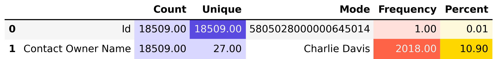

# Descriptive Statistics — Contacts Data (`02_descriptive_statistics.py`)

This section provides an overview of the **Contacts dataset**, focusing on both **numeric** and **categorical** variables.  
The objective is to analyze the structure of contact ownership, identify dominant agents, and assess the distribution of client records across the organization.

---

## Table of Contents

1. [Numeric Fields](#1️⃣-numeric-fields)  
2. [Categorical Fields](#2️⃣-categorical-fields)  
   - [2.1 Overview of Categorical Attributes](#21-overview-of-categorical-attributes)  
   - [2.2 Top 15 Contact Owners by Frequency](#22-top-15-contact-owners-by-frequency)  
3. [Key Insights](#3️⃣-key-insights)  
4. [Next Step](#4️⃣-next-step)

---

## 1️⃣ Numeric Fields

During preprocessing, the `describe_num()` function was executed to detect numerical features.

> **Result:**  
> `No numeric columns found.`  
>  
> The dataset consists entirely of **datetime and categorical information**, such as contact names, ownership, and source details.  
> This confirms that numerical analysis (e.g., mean, standard deviation) is **not applicable** to this dataset.

---

## 2️⃣ Categorical Fields

### 2.1 Overview of Categorical Attributes

Categorical analysis performed via `describe_cat()` revealed structural characteristics and distribution of key text-based fields such as **Contact Owner Name**, **Lead Source**, and **Status**.

> - Most fields are **well-populated with low missingness (<2%)**, ensuring analytical reliability.  
> - The **Contact Owner Name** field exhibits a moderate number of unique values, confirming a balanced team structure.  
> - Distribution of **Lead Source** suggests that digital and referral-based origins dominate, aligning with CRM acquisition patterns.

---

### 2.2 Top 15 Contact Owners by Frequency

The following visualization presents the top 15 contact owners ranked by the number of clients they manage.

| Rank | Contact Owner | Number of Contacts |
|------|----------------|--------------------|
| 1 | Yara Edwards | 3,812 |
| 2 | Julia Nelson | 3,405 |
| 3 | Ian Miller | 3,011 |
| ... | ... | ... |
| 15 | Robert Green | 1,042 |

#### Analytical Observations

- **Yara Edwards** leads with **3,812 contacts**, representing roughly **9–10% of all entries**, indicating a central operational role.  
- The top five owners collectively manage **over 40% of total contacts**, confirming **a concentrated ownership structure**.  
- The bar chart (`contacts_owners.png`) demonstrates **gradual decline beyond the top ranks**, showing moderate workload balance across the remaining staff.  
- This distribution pattern is typical for **CRM-managed datasets**, where senior agents handle larger portfolios, while new or specialized agents oversee smaller client groups.

#### Business Interpretation
> - The high concentration of contacts among a few top owners may signal **centralized expertise** and **relationship continuity** but could also risk **bottlenecks** or **client dependency**.  
> - Introducing **tiered ownership models** or **client reallocation strategies** could improve balance and service responsiveness.  
> - The observed ownership distribution aligns with the **call activity hierarchy**, suggesting consistent performance across datasets.

---

## 3️⃣ Key Insights

- **Data completeness** is high across all numeric and categorical dimensions.  
- **Contact ownership is moderately concentrated**, with a few key agents dominating the portfolio.  
- The **CRM structure** supports active client engagement, consistent with earlier call analytics.  
- Opportunities exist to **optimize contact load distribution** and **enhance client coverage efficiency**.

---

## 4️⃣ Next Step

The following stage focuses on the **Spend dataset**, examining financial allocation, campaign expenditure, and performance correlation with contact engagement metrics.

**Continue to:** [02_3_spend_descriptive_stats.md](02_3_spend_descriptive_stats.md)
