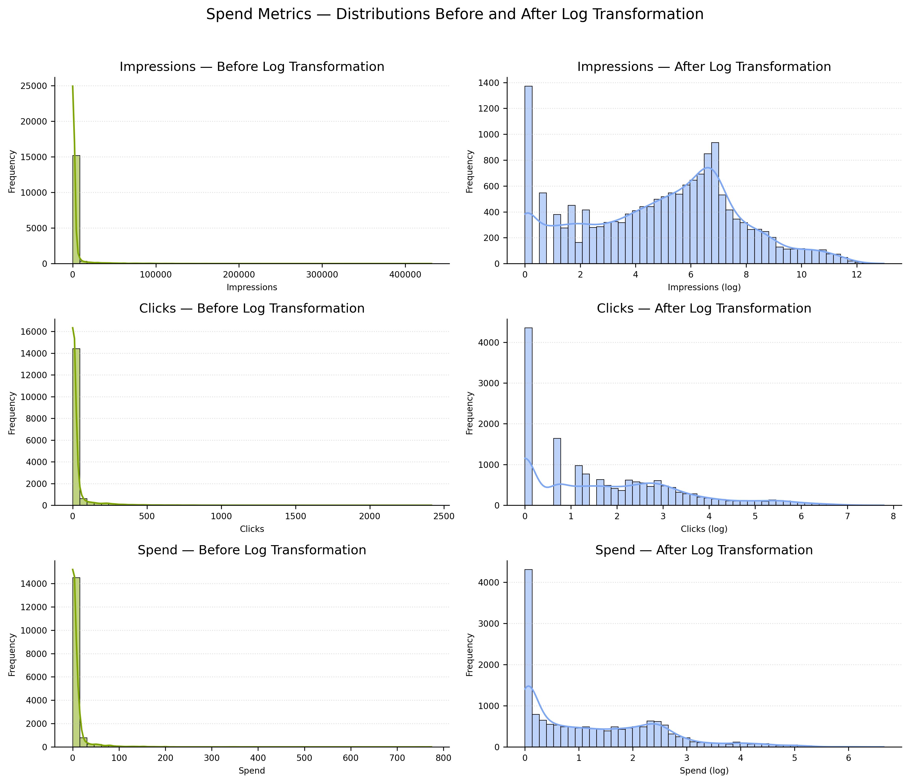
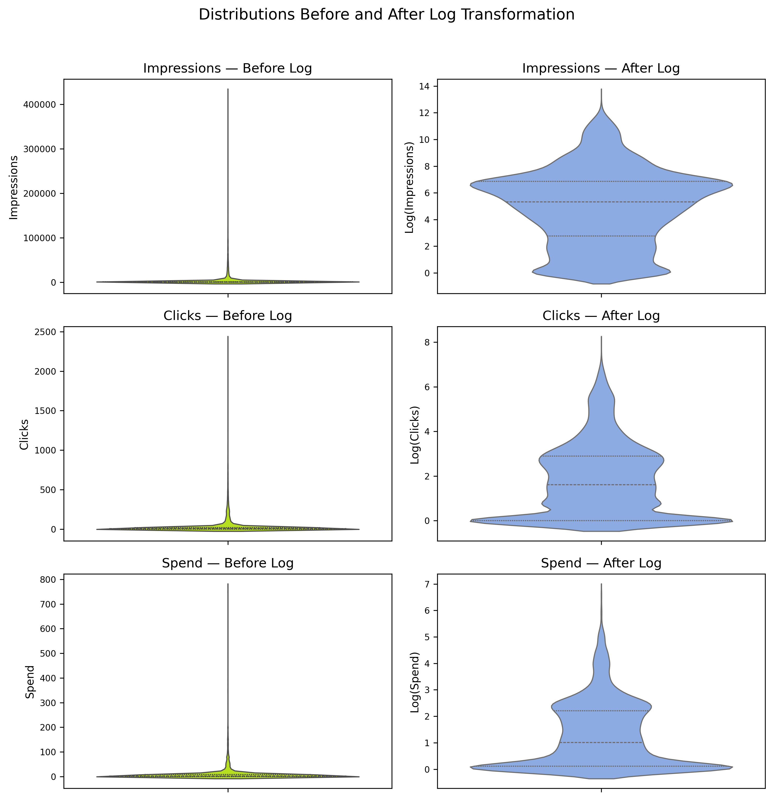
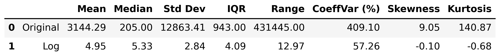
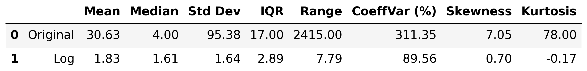
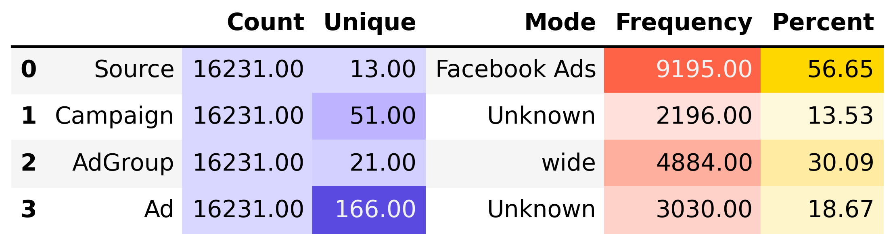

# Descriptive Statistics — Spend Data (`02_3_spend_descriptive_stats.py`)

This section presents the **descriptive statistical analysis** of the cleaned **Spend** dataset.  
It examines both **numeric** and **categorical** fields, focusing on distribution shape, log-transformation effects, and advertising structure patterns.

---

## Table of Contents

1. [Numeric Fields](#1️⃣-numeric-fields)
   - [1.1 Descriptive Overview](#11-descriptive-overview)
   - [1.2 Distributions — Before and After Log Transformation](#12-distributions--before-and-after-log-transformation)
   - [1.3 Violin Plots — Spread Comparison](#13-violin-plots--spread-comparison)
   - [1.4 Impressions — Statistical Comparison](#14-impressions--statistical-comparison)
   - [1.5 Clicks — Statistical Comparison](#15-clicks--statistical-comparison)
   - [1.6 Spend — Statistical Comparison](#16-spend--statistical-comparison)

2. [Categorical Fields](#2️⃣-categorical-fields)
   - [2.1 Overview of Categorical Attributes](#21-overview-of-categorical-attributes)
   - [2.2 Category Distributions](#22-category-distributions)

3. [Key Insights](#3️⃣-key-insights)
4. [Next Step](#4️⃣-next-step)

---

## 1️⃣ Numeric Fields

### 1.1 Descriptive Overview

The `describe_num()` function generated a primary statistical summary for all numeric fields in the **Spend** dataset’s numeric variables — `Impressions`, `Clicks`, and `Spend`. 
All three demonstrate **extreme right-skewness**, large dispersion, and heavy-tailed behavior — hallmarks of digital marketing data where a few high-performing campaigns dominate scale and cost.

> **Key Observations:**
> - **Impressions** range from near-zero to over **430K**, with a coefficient of variation exceeding **400%** — an enormous spread driven by a few massive campaigns.
> - **Clicks** and **Spend** show similarly skewed patterns, suggesting proportional growth across all performance dimensions.
> - High **kurtosis** values confirm the dominance of outliers, implying that typical averages do not represent the dataset well.
> - The data clearly benefits from **logarithmic transformation** to stabilize variance and normalize distributions.

---

### 1.2 Distributions — Before and After Log Transformation

The figure below visualizes the impact of the log transform on distribution shapes.  
Each metric transitions from a compressed, spike-like pattern (left) to a more symmetric, bell-like spread (right).

> **Insights:**
> - The log scale smooths extreme peaks, expanding dense low-value areas.
> - Frequency histograms reveal the underlying population structure that was previously hidden by outliers.
> - This transformation enhances interpretability for regression or correlation-based analyses.

---

### 1.3 Violin Plots — Spread Comparison

The violin plots reinforce the previous observations by illustrating the collapse of extreme variance and improved central symmetry post-transformation.

> **Highlights:**
> - Each distribution’s “tail” nearly disappears.
> - The log scale compresses magnitudes while retaining relative ranking.
> - Variability between campaigns becomes more analyzable — critical for ROI modeling and outlier detection.

---

### 1.4 Impressions — Statistical Comparison

> **Observations:**
> - **Mean** and **Range** fell by over **90–99%**, highlighting how the log transform neutralizes extreme dispersion.
> - **Skewness** dropped from **9.05 → 0.70**, shifting towards near-normal symmetry.
> - **Kurtosis** plummeted from **78 → -0.17**, indicating near-Gaussian tails.
> - Overall, Impressions become statistically balanced, suitable for modeling and clustering.

---

### 1.5 Clicks — Statistical Comparison

> **Observations:**
> - **Variance reduction** is dramatic: standard deviation drops by **>95%**.
> - **Skewness** improves from **7.05 → 0.88**, suggesting moderate symmetry.
> - The transformation successfully eliminates extreme bias from high-click outliers.
> - Distribution now aligns with expectations for log-linear ad performance patterns.

---

### 1.6 Spend — Statistical Comparison

> **Observations:**
> - **Mean** decreased by **~86%**, while **skewness** improved by over **90%**.
> - The flattening of **kurtosis** (from 232 → 0.25) signifies full normalization of extreme campaign costs.
> - Post-log, the dataset achieves an almost Gaussian shape — a strong base for linear modeling of ad efficiency.

---

---

## 2️⃣ Categorical Fields

### 2.1 Overview of Categorical Attributes

Categorical profiling of `Source`, `Campaign`, `AdGroup`, and `Ad` uncovers structural dominance and naming diversity in campaign metadata.

> **Highlights:**
> - **Facebook Ads** leads overwhelmingly with **56.6%** of all records, confirming its central role in spend activity.
> - Campaign and Ad naming conventions are inconsistent — many “Unknown” entries indicate missing metadata.
> - **AdGroup** categories such as “wide” appear frequently, suggesting a mix of broad and targeted segmentation.
> - The distribution imbalance hints at potential optimization opportunities in underused channels.

---

### 2.2 Category Distributions

> **Observations:**
> - **Facebook Ads** dominates the dataset with **57.1%** of all spend records — the platform serves as the main acquisition driver. 
> - **Tiktok Ads (13.7%)**, **Youtube Ads (8.9%)**, and **Google Ads (5.7%)** follow as key secondary channels, forming a strong multi-platform ecosystem.  
> - Within **AdGroups**, the segment **“wide”** leads (31.8%), indicating broad targeting, while other thematic segments such as *recentlymoved*, *women*, or *WebDev interests* show niche diversification.  
> - **Campaign names** reflect structured yet somewhat inconsistent labeling practices — notable repetition of “Unknown” (~17%) and various ad-hoc date strings suggests irregular metadata management.  
> - At the **Ad** level, **over 40%** remain “Unknown”, which obscures full creative-level attribution and optimization insights.
> **Insights:**  
> - The **spend concentration** on Facebook Ads reveals a high reliance on a single channel — a risk and opportunity for diversification.  
> - Missing campaign and ad naming standards reduce **traceability and governance quality**.  
> - The strong presence of targeted subgroups implies ongoing experimentation and segmentation strategies.  
> - Cleaning and standardizing campaign metadata would significantly **improve analytical precision** and **ROI evaluation**.

---

## 3️⃣ Key Insights

- **Raw spend metrics** were highly skewed and dominated by outliers — typical for advertising datasets.  
- **Log transformations** normalized all numeric fields, improving comparability and reducing noise by up to **99%** across key statistics.  
- **Categorical structure** reveals **platform dominance**, **metadata inconsistency**, and **segmentation depth**.  
- Together, these patterns show a **mature marketing setup** with optimization potential in **data quality** and **budget allocation balance**.

---

## 4️⃣ Next Step

The next phase proceeds with the **Deals dataset**, applying the same descriptive methodology — exploring both **numeric** and **categorical** aspects to identify sales conversion trends and financial impact correlations.

**Continue to:** [02_4_deals_descriptive_stats.md](02_4_deals_descriptive_stats.md)
