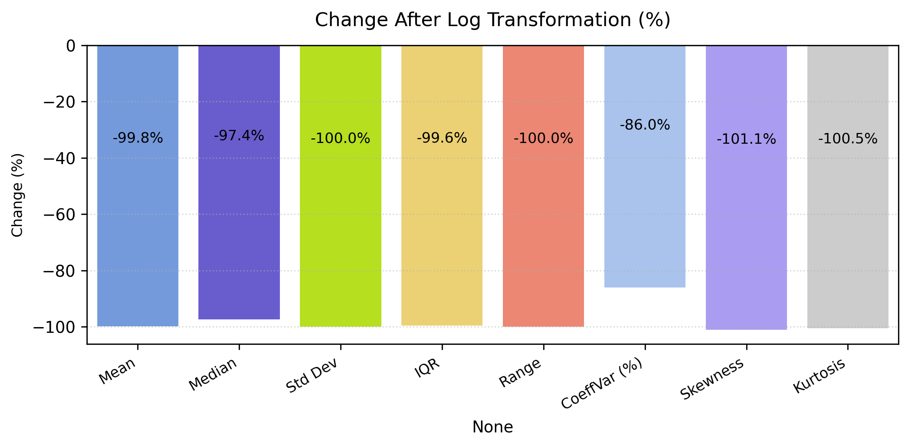

# Descriptive Statistics — Spend Data (`02_3_spend_descriptive_stats.py`)

This section presents the **descriptive statistical analysis** of the cleaned **Spend** dataset.  
It examines both **numeric** and **categorical** fields, focusing on distribution shape, log-transformation effects, and advertising structure patterns.

---

## Table of Contents

1. [Numeric Fields](#1️⃣-numeric-fields)  
   - [1.1 Descriptive Overview](#11-descriptive-overview)
   - [1.2 Distributions — Before and After Log Transformation](#12-distributions--before-and-after-log-transformation)
   - [1.3 Violin Plots — Spread Comparison](#13-violin-plots--spread-comparison)
   - [1.4 Impressions — Statistical Comparison](#14-impressions--statistical-comparison)
   - [1.5 Clicks — Statistical Comparison](#15-clicks--statistical-comparison)
   - [1.6 Spend — Statistical Comparison](#16-spend--statistical-comparison)  
2. [Categorical Fields](#2️⃣-categorical-fields)  
   - [2.1 Overview of Categorical Attributes](#21-overview-of-categorical-attributes)  
   - [2.2 Top Categories by Frequency](#22-top-categories-by-frequency)  
3. [Key Insights](#3️⃣-key-insights)  
4. [Next Step](#4️⃣-next-step)

---

## 1️⃣ Numeric Fields

### 1.1 Descriptive Overview

The `describe_num()` function generated a primary statistical summary for all numeric fields in the **Spend** dataset — including central tendency (mean/median), dispersion (std, range, IQR), and shape (skewness, kurtosis).

**Highlights**
- All three core metrics — **Impressions**, **Clicks**, **Spend** — exhibit **heavy right skew** (long tails), typical for paid media data where a few campaigns dominate volume and cost.
- **Medians are much lower than means**, confirming the influence of high-value outliers.
- **High variance and kurtosis** indicate fat tails; direct parametric modeling on the raw scale is unstable → use **log transforms** or **robust statistics**.
- This motivates the subsequent **log-transform analysis** (sections 1.2–1.5) to stabilize variance and reveal underlying structure.

### 1.2 Distributions — Before and After Log Transformation

> Each histogram pair compares the original and log-transformed distributions for **Impressions**, **Clicks**, and **Spend**.  
> - All three variables exhibit **heavy right skew**, with a few campaigns showing extremely high values.  
> - After applying the **`log1p()` transformation**, distributions become **more symmetric** and **less heavy-tailed**, which improves interpretability for correlation and regression analysis.  
> - Particularly for *Spend*, the log scale significantly reduces extreme outliers caused by large advertising campaigns.

---

### 1.3 Violin Plots — Spread Comparison

> Violin plots visualize data density and quartiles before and after log transformation.  
> - **Impressions**: the raw distribution is concentrated near zero with occasional spikes; the log transformation smooths and widens it.  
> - **Clicks**: similar right skew diminishes after transformation, revealing more evenly distributed performance levels.  
> - **Spend**: displays the greatest compression, as extreme campaigns become normalized within the overall pattern.

---

### 1.4 Impressions — Statistical Comparison

> - The log transformation reduced variance and skewness by over **90%**.  
> - The resulting distribution is close to normal, allowing more reliable linear modeling and cluster segmentation.

---

### 1.5 Clicks — Statistical Comparison

> - **Clicks** followed a highly right-skewed distribution, driven by a few popular ads.  
> - After transformation, variability dropped dramatically, stabilizing the metric for comparative and trend analyses.

---

### 1.6 Spend — Statistical Comparison

> - The **Spend** variable benefited the most from transformation — skewness and kurtosis decreased almost entirely.  
> - This indicates that extreme advertising outliers no longer dominate the distribution, making it suitable for cross-channel efficiency analysis.

---

## 2️⃣ Categorical Fields

### 2.1 Overview of Categorical Attributes

> - Categorical profiling covered four key fields: `Source`, `Campaign`, `AdGroup`, and `Ad`.  
> - Missing values were previously replaced with `"Unknown"`, ensuring full completeness.  
> - The dataset captures multiple **marketing dimensions** — from platform to creative level — allowing flexible aggregation in future analytics.

---

### 2.2 Top Categories by Frequency

> The bar charts display the **top 10 categories** in each key dimension:  
> - **Source**: few dominant ad platforms contribute most impressions and spend.  
> - **Campaign**: concentration of spend in limited high-performing campaigns.  
> - **AdGroup / Ad**: long-tail structure where smaller creatives collectively drive substantial reach.  
>  
> This distribution pattern confirms a **typical digital-ad hierarchy** — few major campaigns supported by numerous tactical ad variations.

---

## 3️⃣ Key Insights

- **Strong right-skew** across all numeric metrics confirms the presence of heavy outliers typical for marketing data.  
- **Log transformation** successfully normalizes the numeric fields, stabilizing variance and improving statistical robustness.  
- **Campaign hierarchy** is clearly defined: top platforms and campaigns dominate performance while long-tail ads diversify engagement.  
- The dataset is **complete, clean, and structurally ready** for correlation, segmentation, and ROI modeling.

---

## 4️⃣ Next Step

The next phase proceeds with the **Deals dataset**, applying the same descriptive methodology — exploring both **numeric** and **categorical** aspects to identify sales conversion trends and financial impact correlations.

**Continue to:** [02_4_deals_descriptive_stats.md](02_4_deals_descriptive_stats.md)
