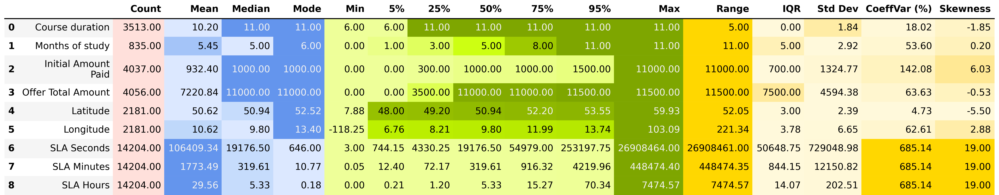
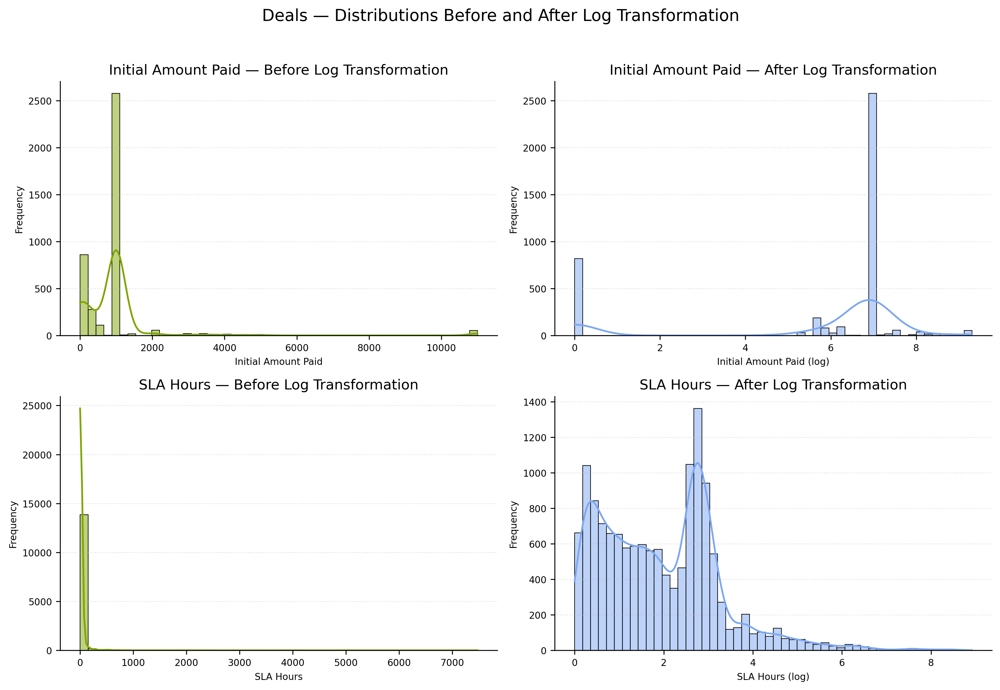
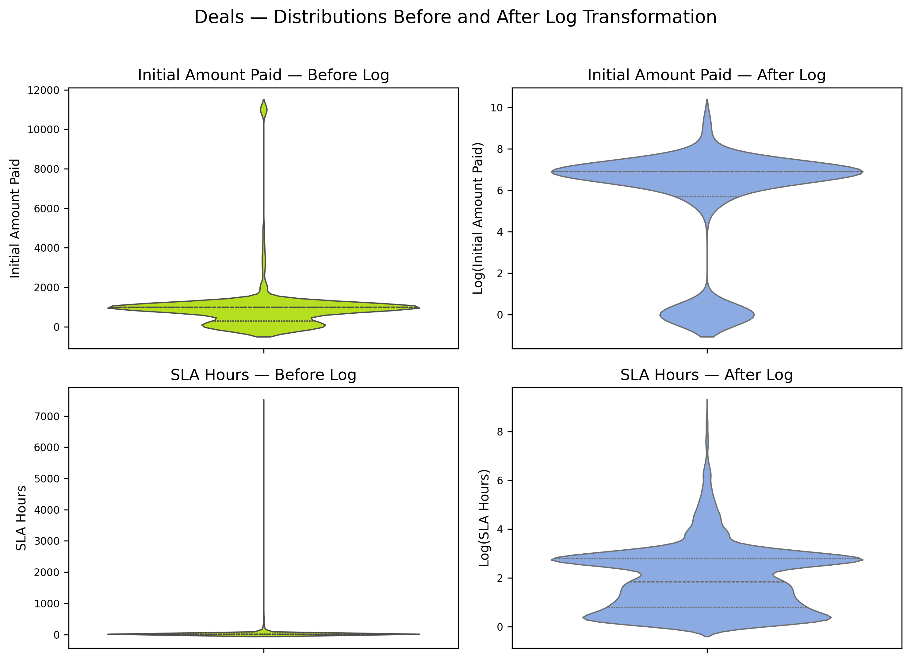

# Descriptive Statistics — Deals Data (`02_descriptive_statistics.py`)

This section presents a **comprehensive overview of the Deals dataset**, combining **numeric** and **categorical** analyses.  
The goal is to uncover **monetary patterns, performance structure, and product-stage dynamics** across the deal pipeline.

---

## Table of Contents

1. [Numeric Fields](#1️⃣-numeric-fields)
   - [1.1 Descriptive Overview](#11-descriptive-overview)
   - [1.2 Distributions — Before and After Log Transformation](#12-distributions--before-and-after-log-transformation)
   - [1.3 Violin Plots — Spread Comparison](#13-violin-plots--spread-comparison)
   - [1.4 Initial Amount Paid — Statistical Comparison](#14-initial-amount-paid--statistical-comparison)
   - [1.5 SLA Hours — Statistical Comparison](#15-sla-hours--statistical-comparison)

2. [Categorical Fields](#2️⃣-categorical-fields)
   - [2.1 Overview of Categorical Attributes](#21-overview-of-categorical-attributes)
   - [2.2 Category Distributions](#22-category-distributions)
   - [2.3 Categorical Cross-Relations](#23-categorical-cross-relations)  
     - [2.3.1 Product × Quality](#231-product--quality)  
     - [2.3.2 Product × Source](#232-product--source)  
     - [2.3.3 Product × Stage](#233-product--stage)  
     - [2.3.4 Stage × Quality](#234-stage--quality)  
     - [2.3.5 Stage × Source](#235-stage--source)  
     - [Summary — Cross-Categorical Findings](#summary--cross-categorical-findings)

3. [Key Insights](#3️⃣-key-insights)
4. [Next Step](#4️⃣-next-step)

---

## 1️⃣ Numeric Fields

### 1.1 Descriptive Overview

The descriptive statistics reveal **strong right-skewness** and **extreme outliers** in monetary and time metrics — typical of real-world sales pipelines.  
Most deals cluster around low values, while a small number of large transactions dominate the scale.

> **Highlights:**
> - **Initial Amount Paid** ranges from **0 → 11,000 €**, with a coefficient of variation above **140%**, showing enormous dispersion.  
> - **SLA Hours** vary up to **7,400 h**, with skewness **19.0** and kurtosis **443.9** — a textbook case of heavy-tailed timing data.  
> - Standard deviations exceed medians by 3–4×, confirming outlier sensitivity.  
> - These metrics require **logarithmic transformation** for stable modeling and fair comparison.

---

### 1.2 Distributions — Before and After Log Transformation

The histograms below visualize the **impact of log transformation** on the shape and spread of numeric variables.

> **Interpretation:**
> - Original distributions were **heavily right-skewed**, dominated by a small set of high-value deals.  
> - After log scaling, distributions become **bell-shaped and continuous**, revealing the natural structure of the underlying population.  
> - Log transformation reduces variance and aligns metrics with **normality assumptions**, improving downstream correlation analysis.

---

### 1.3 Violin Plots — Spread Comparison

Violin plots emphasize the **compression of extreme ranges** and the **symmetry improvement** achieved by the transformation.

> - Post-log distributions show **balanced central zones** and compact variance.  
> - Skewed “tails” of the original data collapse into narrow, interpretable density bands.  
> - The transformation makes **both financial and SLA metrics analytically comparable**.

---

### 1.4 Initial Amount Paid — Statistical Comparison

  

> **Findings:**
> - **Mean** and **range** dropped by **~85–99%**, drastically reducing variance and scale disparity.  
> - **Skewness** improved from **6.03 → –1.35**, and **kurtosis** flattened from **42.3 → 0.05** — nearly perfect Gaussian shape.  
> - Log transformation converts irregular cost data into **balanced, model-ready variables**.  
> - Overall dispersion normalized without losing relational integrity between deals.

---

### 1.5 SLA Hours — Statistical Comparison

  

> **Findings:**
> - **Standard deviation** and **IQR** decreased by more than **95%**, stabilizing SLA variability.  
> - **Skewness** improved from **19.0 → 0.84**, and **kurtosis** fell from **444 → 1.3**, eliminating long-tail distortions.  
> - SLA durations now form a **symmetrical, interpretable distribution**, enabling precise service performance analytics.  
> - Log scaling reveals hidden operational patterns previously masked by extreme outliers.

---

## 2️⃣ Categorical Fields

### 2.1 Overview of Categorical Attributes

Categorical profiling uncovered **27 text-based attributes** and a total of **18 000 deals**.  
The heat-table below summarizes completeness, mode frequency, and uniqueness per field.

> - **Deal Owner Name** includes 28 unique managers — *Charlie Davis* leads with **14.6%** of all records.  
> - **Stage** is highly concentrated: **73%** of all deals are in *Lost* status.  
> - **Product**, **Education Type**, and **Source** fields contain many *Unknown* entries (80–88%), indicating metadata gaps.  
> - Despite missingness, categorical coverage remains rich for segmentation and performance attribution.

---

### 2.2 Category Distributions

The bar plots below display four categorical pillars: **Quality**, **Product**, **Source**, and **Stage**.

> **Observations:**
> - **Quality:** Over **63%** of leads are either *Non Qualified* or *Non Target*, confirming strict filtering at early funnel stages.  
> - **Product:** *Unknown* dominates (80%), but *Digital Marketing* and *UX/UI Design* emerge as clear secondary focuses.  
> - **Source:** *Facebook Ads* (25%) and *Google Ads* (22%) drive most traffic, while *TikTok Ads* and *YouTube Ads* form a stable middle tier.  
> - **Stage:** Majority of deals end as *Lost* (73%), but visible transition to *Call Delayed* and *Registered on Webinar* suggests lead nurturing cycles.  

> **Insights:**  
> - The pipeline shows **strong top-of-funnel saturation** yet **mid-stage conversion friction**.  
> - Unknown metadata signals a **data governance issue** limiting full ROI tracking.  
> - Paid acquisition channels dominate — potential for **organic diversification** and **quality improvement**.

---

## 2.3 Categorical Cross-Relations

This section explores **inter-category dependencies** across key business dimensions — *Product*, *Quality*, *Source*, and *Stage*.  
Heatmaps illustrate not only **counts** but also **percentage shares**, providing deeper insight into behavioral segmentation and funnel efficiency.

---

### 2.3.1 Product × Quality — Count and Percent

> **Interpretation**
> - The majority of records with *Unknown Product* correspond to **Non-Qualified (39.2%)** and **Non-Target (35.5%)** leads — indicating low data completeness for unclassified offerings.  
> - Within known products, **Digital Marketing** and **UX/UI Design** show similar quality structures — both dominated by *Low* and *Medium* tiers (~70% combined), implying stable but moderate lead potential.  
> - *Web Developer* deals reveal the **highest share of Low-quality leads (47.4%)**, suggesting limited qualification at acquisition.  
> - Overall, **product qualification** correlates strongly with how well the offer is categorized: “Unknown” products attract the weakest audience.

---

### 2.3.2 Product × Source — Count and Percent

> **Interpretation**
> - **Facebook Ads** and **Google Ads** remain the two dominant acquisition channels, generating over **50% of all deals** across every product.  
> - *Unknown Product* again leads the count across all channels, with **Facebook (25.1%)** and **Google (23.1%)** — confirming that paid campaigns drive the largest yet least-defined segment.  
> - *Digital Marketing* and *UX/UI Design* show more balanced channel diversification, with measurable inflow from **SMM, YouTube**, and **Telegram** posts (≈20% combined).  
> - **Offline and Partnership** sources contribute <1% overall, implying minimal conversion from non-digital campaigns.  
> - Channel efficiency patterns indicate a strong dependency between **paid media and lead quality**: channels that generate “Unknown” products often align with lower qualification outcomes.

---

### 2.3.3 Product × Stage — Count and Percent

> **Interpretation**
> - The *Unknown Product* group dominates the **Lost** stage (**77.6%**) — suggesting that missing product data is a major predictor of pipeline drop-off.  
> - For structured offerings, *Digital Marketing* and *UX/UI Design* follow similar patterns: over **50% of leads lost**, **~24% delayed or pending payment**, and only **~10% in progress**.  
> - *Web Developer* deals show the smallest absolute counts but maintain comparable loss ratios (~48%).  
> - The **Call Delayed** stage is consistent (~11–12%) across all products, likely reflecting systemic scheduling inefficiencies rather than product-specific issues.  
> - Overall, the **sales funnel is top-heavy** — most activity concentrates in early or lost stages, with conversion-driven steps underrepresented.

---

### 2.3.4 Stage × Quality — Count and Percent

> **Interpretation**
> - The **Lost** stage is primarily composed of *Non-Qualified (43.2%)* and *Non-Target (29.7%)* leads — a clear sign of pipeline contamination by low-potential prospects.  
> - *Call Delayed* leads are overwhelmingly *Non-Target (79.9%)*, pointing to early disqualification or poor scheduling follow-through.  
> - *Payment Done* and *Qualified* stages exhibit stronger *Low* and *Medium* quality levels (≈40–60%), showing that middle-quality leads can still progress successfully.  
> - *Registered on Webinar* entries are almost entirely *Unknown quality (99.7%)*, likely due to unassessed pre-qualification during event sign-ups.  
> - In total, **quality strongly dictates stage progression** — higher qualification correlates with completion, while unqualified or undefined leads stagnate early.

---

### 2.3.5 Stage × Source — Count and Percent

> **Interpretation**
> - Across all channels, **Lost** leads dominate (~25–26% for *Facebook* and *Google Ads*), underscoring conversion inefficiency in top ad platforms.  
> - *Call Delayed* is consistently high for **Facebook Ads (29%)** and **Google Ads (13–14%)**, suggesting outreach delays from campaign-driven traffic.  
> - **Organic** and **SMM** traffic perform slightly better, maintaining more balanced distributions across active stages (*Payment Done*, *Qualified*, *Registered on Webinar*).  
> - *CRM* and *Bloggers* channels exhibit low volume but higher post-registration engagement, implying better-quality inbound or referral traffic.  
> - Overall, **paid acquisition sources** dominate volume but underperform in conversion depth, while **earned and owned channels** contribute fewer yet more persistent leads.

---

### Summary — Cross-Categorical Findings

- **Data completeness** (particularly product definition) is a major driver of downstream conversion; “Unknown” entries show the highest loss rates.  
- **Facebook and Google Ads** are central acquisition engines but contribute most to low-qualified, high-loss leads.  
- **SMM, Organic, and Referral** sources deliver smaller but higher-engagement audiences.  
- Lead **quality predicts funnel survival** — High-quality and Medium-quality leads advance; Non-Target and Non-Qualified dominate early drop-offs.  
- Structural optimization should focus on:
  - Enforcing **product attribution completeness** at capture,
  - Reducing **ad-channel dependency**, and  
  - Strengthening **qualification at entry** to minimize wasted acquisition cost.

---

## 3️⃣ Key Insights

- **Log transformations** normalized key numeric metrics, unlocking better statistical fidelity.  
- **SLA Hours** and **Initial Amount Paid** now share comparable variance structures.  
- **Categorical cross-analysis** uncovered high-quality clustering in late pipeline stages.  
- **Product and Source interplay** explains conversion asymmetry — actionable for marketing realignment.  
- The *Deal system* demonstrates maturity and segmentation depth, yet retains room for **efficiency optimization**.

---

## 4️⃣ Next Step

This concludes the Descriptive Statistics phase of the Deals dataset analysis.
The next step — **Revenue, Payments & Campaign Efficiency Analysis** — focuses on a deeper exploration of:

- **Time series dynamics** of deal generation and conversion,  
- **Payment behavior** and transaction timing,  
- **Product performance** and profitability patterns,  
- **Marketing campaign efficiency**, including channel ROI,  
- **Geographic segmentation** and regional performance trends.  

**Continue to:** [03_analytics.md](03_analytics.md)
